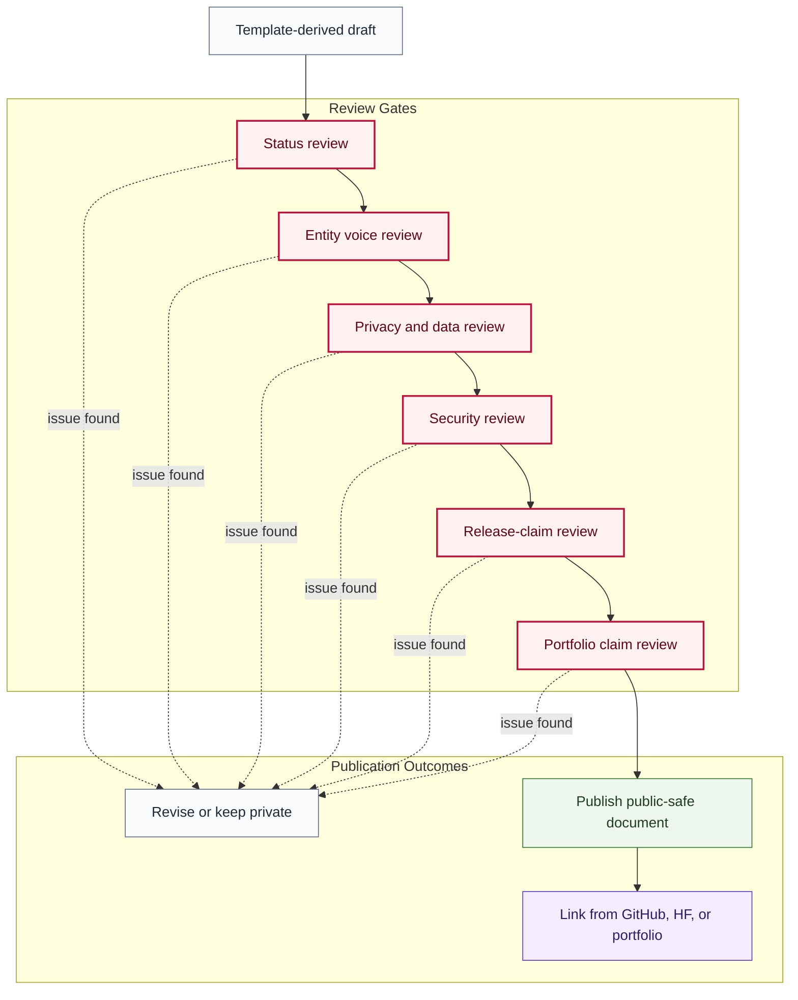

# Document Review Flow

## Purpose

This graph shows the review sequence before a template-derived document becomes public, Foundation-facing, client-facing, or portfolio-facing.

## Mermaid Diagram

## Interpretation Notes

- A structurally valid document can still fail publication review.
- Release-claim review blocks unsupported claims about models, datasets, Spaces, schools, NEURONA, deployments, or services.
- Portfolio review is required before monetization-facing claims.

## Boundary Notes

- Documents derived from private or mixed sources remain private until reviewed.
- Generated summaries, screenshots, and examples inherit source boundaries.
- Foundation references must not become company marketing or client bait.

## Follow-Up Actions

- Record review status in the target repository.
- Add reviewer notes outside public repos when sensitive.
- Re-run validation after revisions.
