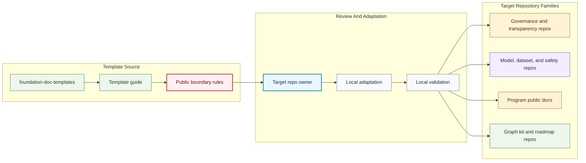

# Documentation Standard Map

## Purpose

This graph shows how public Foundation repositories reuse templates through review, boundary checks, local adaptation, and validation.

## Mermaid Diagram

## Interpretation Notes

- Templates are a public starting point, not automatic authority.
- Each target repo must adapt templates to its own owner, status, boundary, and validation.
- Boundary rules are part of the reuse path, not optional documentation.

## Boundary Notes

- Templates must not include real private examples.
- Target repos must not use template reuse to bypass governance, safety, data, or release review.
- Generated examples inherit source boundaries until reviewed.

## Follow-Up Actions

- Add template version tags after the first human review.
- Link target repos as they adopt templates.
- Update this map when new template families are added.
