# Public Private Boundary Map

## Purpose

This graph separates material allowed in public templates from material that must remain private, sealed, or blocked.

## Mermaid Diagram

```mermaid
flowchart LR
  subgraph public["Allowed Public Template Material"]
    templates["Templates"]:::public
    synthetic["Synthetic examples"]:::public
    status["Status vocabulary"]:::public
    diagrams["Public-safe diagrams"]:::public
    checklists["Review checklists"]:::public
  end

  subgraph blocked["Blocked Material"]
    donor["Donor private data"]:::sealed
    student["Student data"]:::sealed
    volunteer["Volunteer private data"]:::sealed
    operations["Private Foundation operations"]:::sealed
    corpora["Private training corpora"]:::sealed
    sealedIp["Sealed YOSO-YAi LLC IP"]:::sealed
    secrets["Secrets or tokens"]:::sealed
    neurona["Security-sensitive NEURONA details"]:::sealed
  end

  subgraph review["Human Review"]
    boundary["Boundary review"]:::risk
    release["Release-claim review"]:::risk
    publish["Public-safe publication"]:::release
  end

  public --> boundary
  blocked -. excluded .-> boundary
  boundary --> release
  release --> publish

  classDef public fill:#edf7ed,stroke:#3a7d3a,color:#1f3d1f;
  classDef release fill:#f4edff,stroke:#6941c6,color:#2f1b63;
  classDef sealed fill:#fdecec,stroke:#b42318,stroke-width:2px,color:#5f1711;
  classDef risk fill:#fff1f2,stroke:#be123c,stroke-width:2px,color:#5f0715;
```

## Interpretation Notes

- Synthetic examples are public-safe only when they do not derive from private records.
- Blocked material cannot be converted into public examples by paraphrase without review.
- Public publication is downstream from boundary and release-claim review.

## Boundary Notes

- No donor, student, volunteer, customer, private operations, sealed IP, secrets, or sensitive NEURONA details may appear.
- Exact sensitive infrastructure locations are excluded.
- Unreviewed claims about releases, programs, or services are excluded.

## Follow-Up Actions

- Keep boundary language in each template.
- Update blocked categories when new sensitive artifact types appear.
- Align downstream repos to this boundary map.
