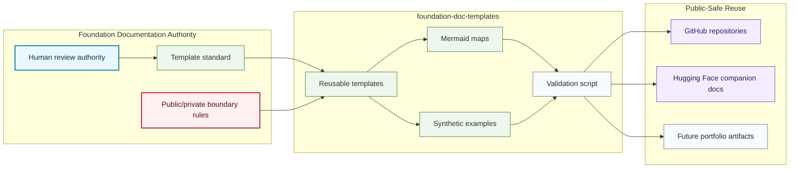

# Template System Map

## Purpose

This graph shows how the template kit separates standards, templates, synthetic examples, validation, and downstream public repositories.

## Mermaid Diagram

## Interpretation Notes

- Templates are downstream from human documentation authority and boundary rules.
- Synthetic examples are allowed because they do not describe real Foundation operations.
- Validation checks structure; it does not replace human publication review.

## Boundary Notes

- Private examples, donor data, student data, volunteer data, customer data, sealed IP, and release claims are blocked.
- Hugging Face reuse is limited to companion documentation and release-ready public cards.
- Portfolio reuse requires Alexandra review before claims are published.

## Follow-Up Actions

- Add version tags after human review.
- Link downstream repositories as they adopt the templates.
- Expand validation if new template families are added.
