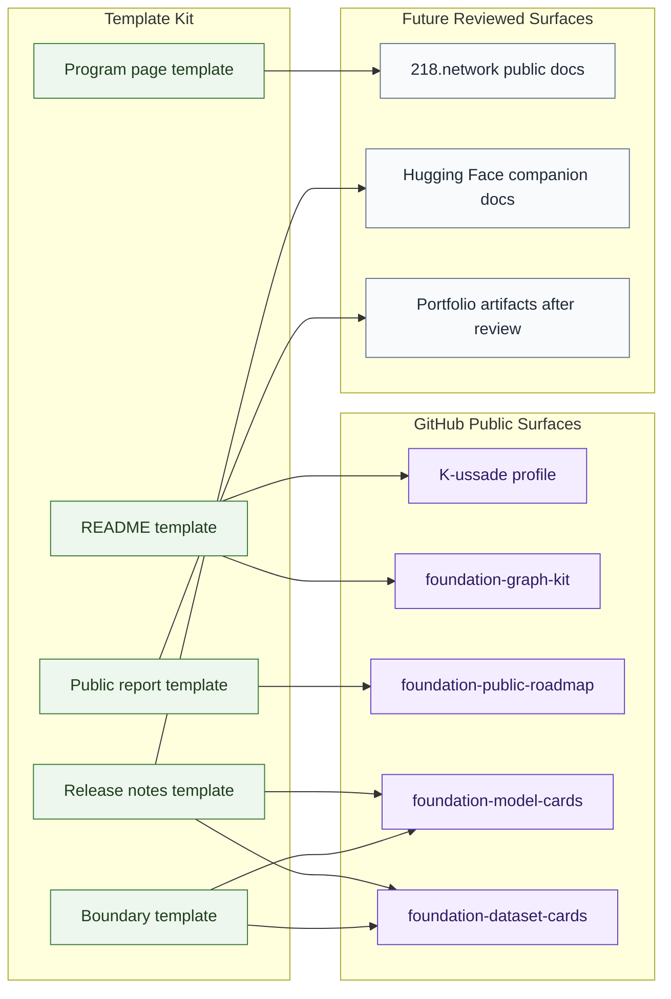

# Template To Repo Map

## Purpose

This graph maps the template kit to the public repositories that may reuse it.

## Mermaid Diagram

## Interpretation Notes

- Existing public repositories can use templates as public documentation infrastructure.
- Future `218.network`, Hugging Face, and portfolio reuse requires status review.
- Template reuse does not imply any model, dataset, Space, school, NEURONA, deployment, or service has been released.

## Boundary Notes

- Links must not imply missing artifacts exist.
- Hugging Face companion docs require model-card, dataset-card, or Space review before release.
- Portfolio use stays draft until Alexandra approves the claim and proof link.

## Follow-Up Actions

- Update this map as public repositories adopt the templates.
- Keep repository statuses aligned with `foundation-public-roadmap`.
- Add review notes in target repositories before publication.
