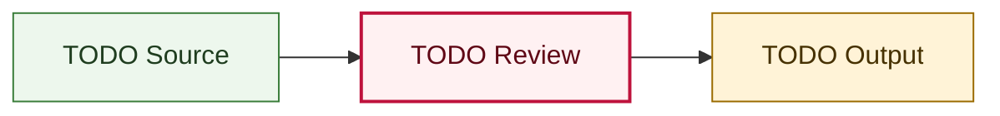

# Graph Template

## Purpose

TODO: State the operational question this graph answers.

## Mermaid Diagram

```mermaid
flowchart LR
  source["TODO Source"]:::public
  review["TODO Review"]:::risk
  output["TODO Output"]:::foundation

  source --> review
  review --> output

  classDef foundation fill:#fff3d7,stroke:#9a6b00,color:#463100;
  classDef public fill:#edf7ed,stroke:#3a7d3a,color:#1f3d1f;
  classDef risk fill:#fff1f2,stroke:#be123c,stroke-width:2px,color:#5f0715;
```

## Interpretation Notes

- TODO

## Boundary Notes

- TODO

## Follow-Up Actions

- TODO
